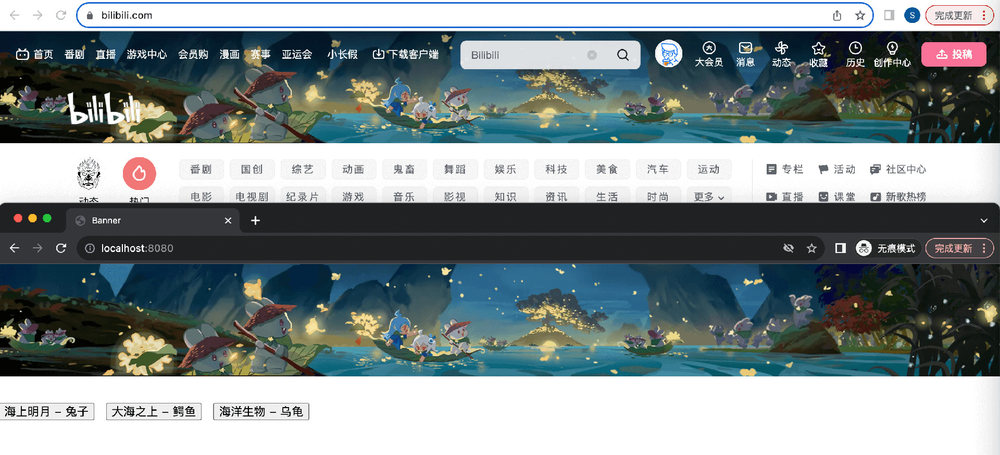

<!--
 * @Author: ShawnPhang
 * @Date: 2023-10-03 22:51:33
 * @Description:  
 * @LastEditors: ShawnPhang <https://m.palxp.cn>
 * @LastEditTime: 2026-01-09 15:16:03
-->

# bilibili-banner 仿B站首页动态头图

- 原生 JavaScript 实现，无第三方依赖
- 自动抓取资源，生成配置，可快速复刻 B 站动态 Banner 及交互效果，接近 1:1 还原

[查看在线演示](https://palxiao.github.io/bilibili-banner/)

------

> 自动化通常只能完成 90% 的工作，有些参数需要点技巧进行手动调整，具体可参考下方说明和往期数据。
> 
> 数据更新可能不及时或错过，如果你恰好发现B站更新头图，欢迎 PR ~
> 
> 最后，希望你喜欢这个项目❤️

### 准备工作

运行 `pnpm i` 或 `yarn / npm i` 安装项目本地运行环境

### 查看演示网页

1. 运行 `npm run serve`

### 获取最新效果

1. 运行 `npm run grab xxx`，抓取B站首图数据，自动在 `assets` 目录下生成数据（以当天日期命名）
2. 运行 `npm run serve` 查看效果

例如，在 10 月 25 号这天发现 B 站更新了 Banner，可以运行：`npm run grab "打工松鼠 - 猫头鹰"`（需要给 Banner 起个名字），然后运行 `npm run serve`，访问 `http://127.0.0.1:8080` 即可看到最新的效果。

> 可选：在 `config.js` 中修改配置（使用 fetch 引入 json）

### 手动调整参数

打开 `assets` 目录下对应的 `data.json` 文件，修改其中每个对象的参数，刷新网页查看效果。

目前支持参数如下：

| 属性 | 类型 | 说明 |
| --- | --- | --- |
| a | number | 表示加速度，数值越高移动变化越大（接受正负值） |
| deg | number | 表示旋转幅度，数值越高旋转越快（接受正负值） |
| g | number | 表示重力，数值越高上下移动变化越大（接受正负值） |
| f | number | 表示大小变化，对应 CSS transform: scale |
| opacity | array | 透明度变化，接收一个区间 |

> 注：正负值会影响变化的方向

### 项目开发历程

[复刻 Bilibili 首页头图的视差交互效果技术原理详解](https://juejin.cn/post/7269385060611997711)

[三分钟复刻B站首页动态Banner](https://juejin.cn/post/7288331623992688680)

[一键自动1比1复刻 B 站首页动态 Banner](https://juejin.cn/post/7295720738568159267)
